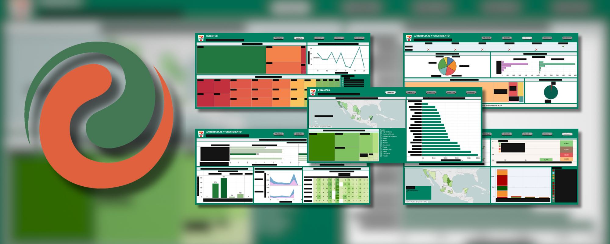

# OpenLaborData

> "Information is the oil of the 21st century, and analytics is the combustion engine."  
> — Peter Sondergaard (Gartner IT Symposium/Xpo, October 2011).

The intelligent collection, cleaning, processing and visualization of data is an indispensable process for the efficient, precise, productive and sharp **self-criticism** of any project. 

This project seeks to identify patterns of excessive overtime, calculate the profitability of additional hiring, and quality of existing hires based on turnover by employee type, contract and leave circumstances.

## Background
Includes ideas developed during my second collaboration with Iconn Group (7-Eleven) at Tecnologico de Monterrey.

## Current development

> [!IMPORTANT]
> Pending approval and modifications to be treated as Open Source, as intended.

## Future work

- Facilitating export with gganimate.
- Native ggplot2-shiny dashboards.
- Local UX/UI.

## Contact

Feel free to reach out if you have any questions or feedback.

- **Email:** victorbenitogr@gmail.com
- **The subject must start with:**  [OpenLaborData]